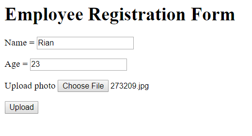
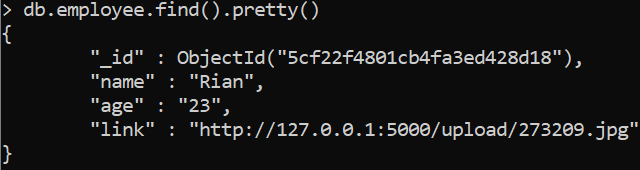

# Simple Employee Registration Program using Flask and mongoDB
A simple Python project to create an employee registration form using *Flask* framework and storing the data into *mongoDB* database using *pymongo* package in Python.
1. Activate *mongoDB* server:
    ```bash
    $ cd C:\Program Files\MongoDB\Server\4.0\bin
    $ mongod
    ```
    Open new terminal & type again:
    ```bash
    $ cd C:\Program Files\MongoDB\Server\4.0\bin
    $ mongo
    ```
2. Create database (db) and collection (col) first, do this on *mongo*:
    ```bash
    > use testdb
    > db.createUser({user: "<yourUsername", pwd: "<yourPassword>", roles: ["readWrite", "dbAdmin"]})
    > db.createCollection('employee')
    ```

2. Create a new folder named 'storage' to store the uploaded photos.

3. Clone this repo & run *regist.py* file. Make sure that the *mongoDB server* is still active.

4. A screenshot of how the main route will look like:
    
    
5. To check the saved database in mongoDB, use:
    ```bash
    > db.employee.find().pretty()
    ```
    and the saved database would look like:
    

### **_Enjoy!_**

#

#### Albertus Rianto Wibisono ✉ _albertusrian95@gmail.com_

[Instagram](https://www.facebook.com/rian__wibisono) | 
[LinkedIn](https://www.linkedin.com/in/albertusrian95/) |
[GitHub](https://www.github.com/RiantoWibisono)
